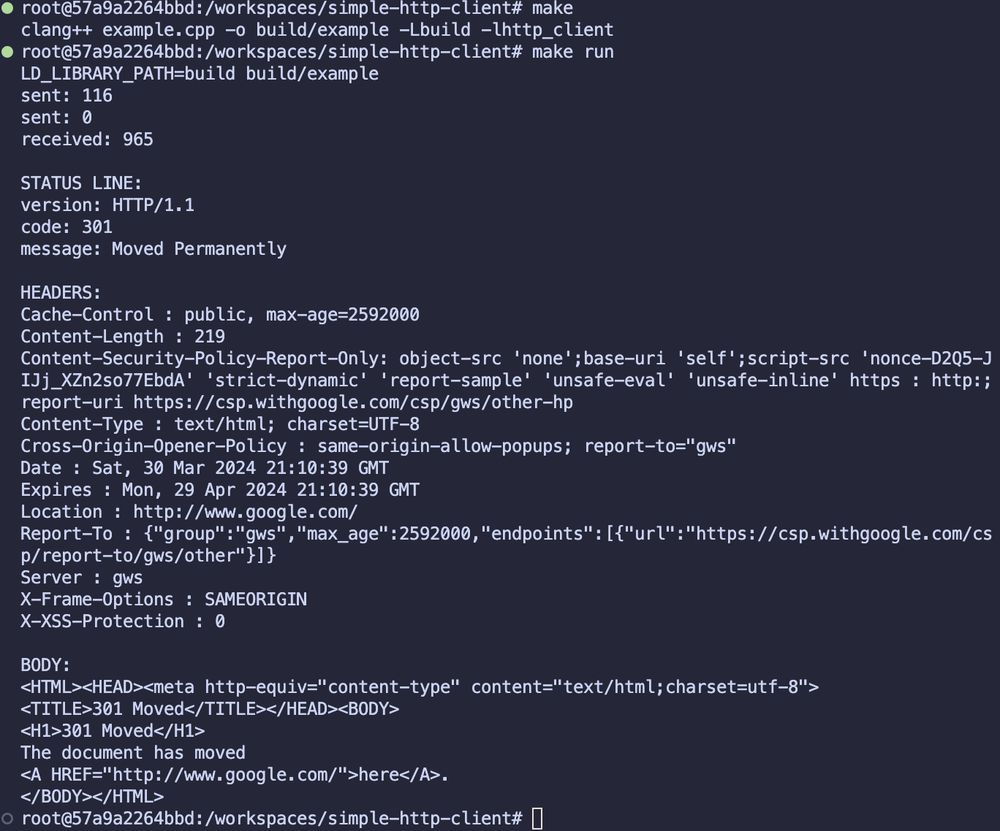

## simple-http-client

A simple HTTP client implemented on Linux system calls and wrapped in C++ classes.
**Note:** I wrote it over 2 yrs ago to get familiar with Linux networking. For production use, consider using a more robust library like [curl](https://github.com/curl/curl).



## Requirements

- Linux OS
- C++11 compiler
- make

If you don't have a Linux OS, you can use Docker. The Dockerfile is in the root directory. I tested it only with VSCode's Dev Containers extension.

## Build and Run

```bash
make
make run
```
